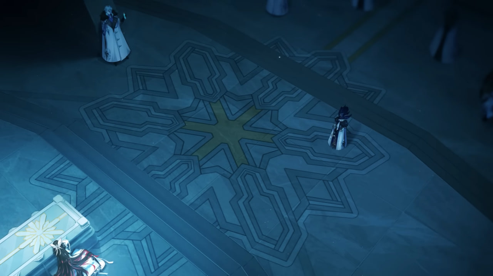

# Снежная (Snezhnaya)
Здесь я собираю все свои заметки про Снежную так как мне очень интересен этот регион, его устройство и обитатели. Некоторые мысли могут показаться отдалёнными от реальности, но я просто записываю предположения чтобы не забыть, а там кто знает, может что-то из этого и окажется правдой.

## Story

## Lore

### Новый мир Царицы
Во многих цитатах предвестников и фатуев упоминается создание уничтожение старого греховоного мира (и предположительно создание нового безупречного мира):

> «...Простите... Что вам пришлось взять все обиды мира на себя. Вы выдержали мой жестокий холод, значит в вас буйствует желание жечь.
Тогда сожгите для меня этот старый мир».

> Пьеро: Но я, Розалина, обещаю тебе...
Пьеро: Твоим последним пристанищем станет весь «Старый мир».

> Мне снился долгий, долгий сон.
Мне снилось, что мы с тобой снова встретились в чистом белом мире, который мы создали. 
<...>
Но всё это уже не важно. Я должна продолжать идти вперёд. Я должна сжечь всё позади себя. Я должна верить в чистое, безупречное, вечное царство, о котором он говорил. Царство, которое я видела в «глазе порчи». Царство, которое он позволил мне увидеть, в конце горизонта, в снах Её Величества.

> Мы не бросаем тех, кто следует с нами за звездой полярной ночи,
кто идёт за нами в царство тьмы, чтобы создать новый мир.
Все знают - чтобы создать новый порядок, надо разрушить старый.
После очищения настанет новый безупречный рассвет

Здесь упоминаются такие вещи как: старый мир (порядок), мечта царицы о прекрасном мире, мир в котором Синьора воссоедениется со своим возлюбленным, новый мир (порядок).
Всё это может быть отсылкой к философии Русского космизма, а именно к идеям Н. Фёдорова:

> Николай Фёдорович Фёдоров (1829—1903). Считал, что глубинный смысл христианства заключается в Воскрешении предков. Но Воскрешение осуществит Бог нашими руками, с помощью современной науки, которая от Бога. Однако миллионы воскрешённых не уместятся на нашей планете, поэтому Фёдоров предлагал заселить ими другие планеты. Так родился замысел освоения космического пространства.

Возможно мечта царицы в том чтобы свергнуть богов и построить новый мир с возрождением всех кто погиб когда-то.
Для большего раскрытия этой точки зрения я бы порекомендовал прочесть [этот пост](https://www.reddit.com/r/Genshin_Lore/comments/z9abtm/an_unhinged_analysis_of_fischl_could_she_be_real/). В нём сравнивается история Фишль, персонажа из книги, и возможная история Царицы и то что литературная Фишль может быть Царицей.
Об этом, кстати, может нам говорить и сходство одного из двух мотифов Фишль в трейлерах с темой Фатуи.

### Крио глаз бога
Думаю лучше всего тут подойдёт цитата из сборника Бердяева:
> Подойти к разгадке тайны, сокрытой в душе России, можно, сразу же признав антиномичность России, жуткую ее противоречивость. <...> Противоречия русского бытия всегда находили себе отражение в русской литературе и русской философской мысли. Творчество русского духа так же двоится, как и русское историческое бытие. <...> Ту же загадочную антиномичность можно проследить в России во всем. Можно установить неисчислимое количество тезисов и антитезисов о русском национальном характере, вскрыть много противоречий в русской душе. 
["Судьба России" Н. Бердяев](https://predanie.ru/book/69716-sudba-rossii/)

Таким образом мы можем понять что все владельцы глаза бога Крио сочетают в своём характере какую-то противоположность своей главной амбиции (которая может приносить страдание или неудволетворенность).
Даже те кто вроде бы живут счастливо и без противоположности на поверхности на самом деле имеют её, просто чёть глубже зарытую.

Например многие скажут что Шарлотта довольна счастлива и выпадает из этого правила, но:
> Этот круглолицый господин, очевидно, не горел желанием делиться правдой - он увиливал от вопросов, как мог. Молчали и нанятые им водолазы. Их лёгкие и барабанные перепонки были изранены, незаконно долгий рабочий день довёл их до изнеможения, скафандры их были ветхими, а еда отвратительной - но перед лицом Долландера они не осмеливались открыть рот. Он довольно хихикал при виде того, что девушка не может ничего от них добиться. <...> Кто-то рассказывал, что Долландер тайно назначил награду за некую камеру с важными для него снимками. <...> В этот момент главная дверь редакции распахнулась, и в неё вошла Шарлотта - в лохмотьях, без очков и босиком. Положив на стол Господина Верите, она усмехнулась: «У меня всё заснято!» **Никто не стал задавать вопросов о том, что ей пришлось пережить.**
[Глаз Бога](https://genshin-impact.fandom.com/ru/wiki/%D0%A8%D0%B0%D1%80%D0%BB%D0%BE%D1%82%D1%82%D0%B0/%D0%98%D1%81%D1%82%D0%BE%D1%80%D0%B8%D0%B8#%D0%93%D0%BB%D0%B0%D0%B7_%D0%91%D0%BE%D0%B3%D0%B0)

Даже у неё есть обратная сторона амбиции журналиста - возможно она должна видеть и рассказывать людям правду даже если она горька.

### Символ церкви Снежной ✳

Можно предположить что мы имеем некий символ Царицы или её религии. Этот символ виден в трейлере "Лаццо в зимней ночи" почти везде в храме в котором происходит действие трейлера.

<!--  -->

Помимо прямой отсылки на православный крест, этот символ так же может отсылать на Вифлеемскую звезду или же по другому на звезду Богородицы (особенно в православии).

> Православная религия считает, что именно восьмиконечная Вифлеемская звезда загорелась на небе во время Рождества Христова и, двигаясь по небосклону, привела волхвов к колыбели Христа для поклонения.
[Сколько лучей у Рождественской звезды](https://rcntsluck.by/2020/11/25/skolko-luchej-u-rozhdestvenskoj-zvezdy/)

> Изображение восьмиконечной звезды используется в иконах Божией Матери (например: Неопалимая Купина) и запрестольных иконах, символизируя ту звезду, которая вела волхвов на поклонение Христу Младенцу. В церковной практике с двух сторон её обычно пишутся образа: с одной стороны — Знамения Божией Матери, с другой — Святого Николая Чудотворца, или, реже, того святого, в честь которого освящен храм.
[Октаграмма](https://ru.wikipedia.org/wiki/%D0%9E%D0%BA%D1%82%D0%B0%D0%B3%D1%80%D0%B0%D0%BC%D0%BC%D0%B0)

А теперь обратимся к другому отрывку из игры, к песне предвестников из лука Полярная звезда:

> О, Предвестники, яркие звёзды полярной земли,
направьте нас в бесконечном пути.
<...>
обрати свой взор к мертвенно-белой звезде, что ведёт нас,
[Полярная звезда](https://genshin-impact.fandom.com/ru/wiki/%D0%9F%D0%BE%D0%BB%D1%8F%D1%80%D0%BD%D0%B0%D1%8F_%D0%B7%D0%B2%D0%B5%D0%B7%D0%B4%D0%B0)

Всё это подводит к тому что Царица может как-то относится к Богородице из православия. Так как она также ведёт своих последователей как Вифлеемская звезда вела волхвов к дому Богородицы.

### Просто мелкие заметки
- Тарталья мог упасть в так называемое "[провалище](https://ru.wikipedia.org/wiki/%D0%9F%D1%80%D0%BE%D0%B2%D0%B0%D0%BB%D0%B8%D1%89%D0%B5)" - ушедший под землю объект, как правило, сакральный (часовня, церковь, монастырь), на месте которого возникает озеро или родник, реже холм или гора. Появившийся новый сакральный объект считается каналом связи между этим и иным миром.

## Music
[All Snezhnaya and Fatui related music](https://youtube.com/playlist?list=PLaLQ5UkLeOYUS8OdVQOKUithoeW-4eWz1&si=OfiRKRNTt8P_PpKu)

[Сравнение темы Фишль и Фатуев](https://www.youtube.com/watch?v=_nNkbJMRryg)

## Arts

## Characters
